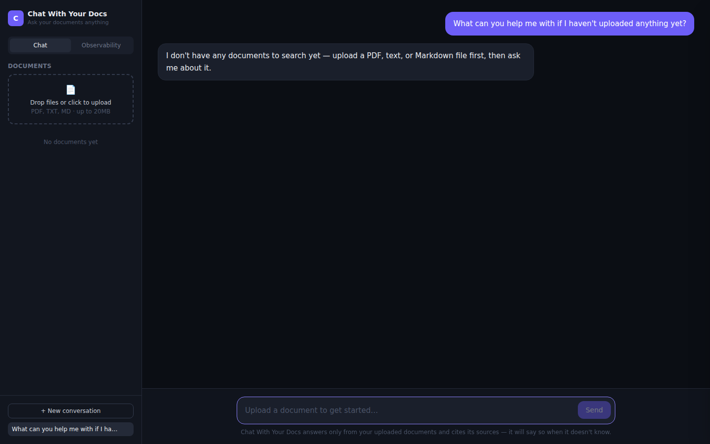
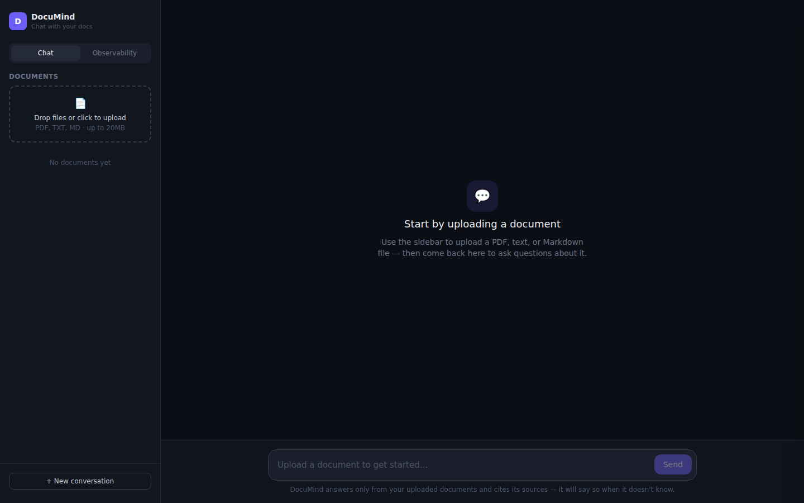
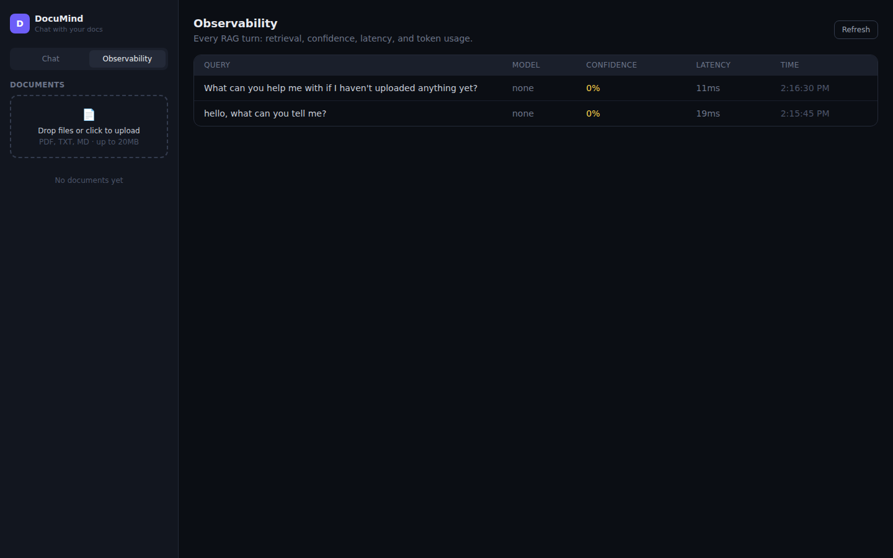
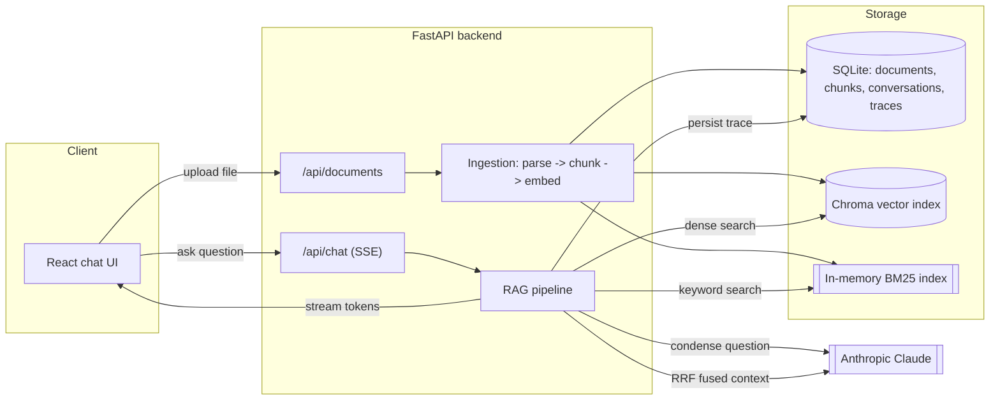

# Chat With Your Docs

A RAG assistant that answers questions about a collection of PDF/TXT/Markdown files, with inline citations, a confidence signal, and a built-in observability panel that shows exactly what was retrieved and why for every answer.

FastAPI + hybrid (vector + BM25) retrieval + Claude, with a React/TypeScript chat UI (Tailwind, Radix/shadcn-style primitives, Motion, react-pdf for source previews — responsive down to mobile, with a Sheet-based drawer nav below the `md` breakpoint).



|                                          |                                                            |
| ---------------------------------------- | ---------------------------------------------------------- |
|  |  |

## Contents

- [Quick start](#quick-start)
- [Architecture](#architecture)
- [Design decisions](#design-decisions) — chunking, embeddings/LLM, retrieval, prompting, context, guardrails, quality, observability
- [Testing](#testing)
- [AI-assisted development](#ai-assisted-development)
- [Known limitations](#known-limitations--what-id-add-next)

## Quick start

```bash
cp .env.example .env        # add your ANTHROPIC_API_KEY
docker compose up --build
```

- Frontend: http://localhost:8080
- Backend API docs: http://localhost:8000/docs

The first `docker compose up --build` takes a few minutes — the backend image bakes the embedding model weights into itself at build time (see [why](#embedding-model--llm-selection)).

**Local dev without Docker:**

```bash
# backend
cd backend && python -m venv .venv && source .venv/bin/activate
pip install -r requirements.txt
ANTHROPIC_API_KEY=sk-ant-... uvicorn app.main:app --reload

# frontend (separate terminal)
cd frontend && npm install && npm run dev   # http://localhost:5173, proxies /api to :8000
```

Run the backend test suite (fully offline, no API key needed — see [Testing](#testing)):

```bash
cd backend && source .venv/bin/activate && pytest
```

## Architecture



One request-response cycle for a question, end to end:

1. **Guardrail** the input (length, non-empty).
2. **Condense** the question against recent chat history into a standalone query (skipped on the first turn — see [Context management](#context-management--multi-turn)).
3. **Hybrid retrieve**: dense vector search (Chroma) + BM25 keyword search, fused with Reciprocal Rank Fusion.
4. **Confidence guardrail**: flag (not block) the response if the top match is weak.
5. **Build the grounded prompt**: retrieved chunks wrapped in `<document>` tags, injected into a system prompt that mandates citations and forbids outside knowledge.
6. **Stream** the answer from Claude token-by-token over SSE.
7. **Persist** a `Trace` row (query, condensed query, every retrieved chunk + its scores, latency breakdown, token usage) for the Observability panel.

## Design decisions

### Chunking

Hand-written recursive character splitter (`backend/app/rag/chunking.py`) — no LangChain. It tries paragraph breaks first (`\n\n`), then line breaks, then sentence boundaries, then words, then a hard cut, only falling back to the next-smaller boundary for pieces still over the size limit. That keeps whole paragraphs/sentences together far more often than a fixed sliding window. Overlap (150 chars over a 900-char target) is layered on top afterward so a fact split across a boundary is still visible in whichever chunk retrieval happens to pick.

**Chunking is per-page**, not per-document: PDFs are parsed page by page, and each page is chunked independently, so every chunk carries one accurate page number for citation. The trade-off is a chunk can never span a page break — a sentence continuing from the bottom of page 4 to the top of page 5 can lose context. I decided accurate page citations were worth more than that edge case for this assignment; the fix (a global sliding window with page-*range* citations) is straightforward and listed under [What's next](#known-limitations--what-id-add-next).

Numbers (900/150) are a starting point, not tuned against a real eval set — see [Testing](#testing) for how I'd actually tune them.

### Embedding model & LLM selection

**Embeddings: local `sentence-transformers/all-MiniLM-L6-v2`**, not an API (OpenAI, Voyage). Reasoning:
- Anthropic doesn't offer an embeddings endpoint, so *some* second provider is unavoidable if you want vector search — the question is API vs. local.
- A local model means the only paid/external dependency in the whole stack is Anthropic. No second API key to provision, no per-embedding cost, works offline once the weights are cached (which is why the Dockerfile bakes them in at build time rather than lazily downloading on first request — a cold first query in an unfamiliar network shouldn't be the moment a 90MB model download kicks in).
- Honest trade-off: MiniLM measurably lags OpenAI's `text-embedding-3` / Voyage-3 on retrieval benchmarks, especially on longer or more nuanced passages. Swapping it is a one-file change (`backend/app/rag/embeddings.py`) since nothing else touches the model directly — worth doing before this went anywhere near production traffic, especially for a domain with a lot of jargon.

**Generation: Claude, two models for two jobs.** The user-facing answer uses `claude-3-5-sonnet-latest` at `temperature=0.2` (low but not zero — factual synthesis, not verbatim lookup). Query condensing (see below) uses `claude-3-5-haiku-latest`: it's a small, low-stakes utility call on every multi-turn message, so it shouldn't pay Sonnet's latency or cost. Splitting "cheap utility call" from "user-facing generation call" this way is a common production pattern and it was worth doing here even at demo scale, mostly because it's *free* to do — it's one config line (`condense_model` in `config.py`), not an architecture change.

### Retrieval approach

**Hybrid: dense vector search + BM25, fused with Reciprocal Rank Fusion** (`backend/app/rag/retriever.py`). Dense embeddings are good at semantic similarity but a small local model like MiniLM routinely under-represents exact tokens that matter in real documents — model numbers, acronyms, error codes, proper nouns — because they're thin in its training data. BM25 is the opposite: exact-match, blind to paraphrase. Running both and fusing by rank (not by score) sidesteps the real problem with hand-weighting them: cosine similarity and BM25 scores live on completely different, incomparable scales, so `0.6 * vector_score + 0.4 * bm25_score` is a number that looks precise and isn't. RRF only needs each ranking's *order*, which is why it's the standard default over a tuned weighted sum.

I verified this concretely rather than assuming it: `test_hybrid_retrieve_finds_keyword_match_via_bm25` seeds the (test) vector index with *random* embeddings and checks that a distinctive keyword ("drip irrigation") still surfaces top-ranked — i.e., BM25 is actually carrying weight in the fusion, not just decoration.

### Prompt engineering

Everything lives in `backend/app/rag/prompts.py` so it's auditable in one place. Two guardrails are baked directly into the system prompt rather than built as separate filtering passes:

1. **Groundedness.** The model is told explicitly to answer only from the given excerpts, to cite every claim with `[n]`, and to say plainly "the documents don't cover that" rather than fill the gap with outside knowledge. This is treated as the *primary* defense against hallucination — a numeric similarity threshold is a much blunter, noisier instrument (see [Guardrails](#guardrails)).
2. **Prompt-injection resistance.** Retrieved text is wrapped in `<document id="n" source="..." page="...">` tags, and the prompt states explicitly that content inside those tags is *data*, never instructions — direct mitigation against a document that happens to contain "ignore previous instructions and…" (accidentally, e.g. copy-pasted from an email thread, or deliberately in an adversarial-upload scenario). I did not build an automated red-team test for this; it's a real gap, called out below.

### Context management (multi-turn)

Two mechanisms, both deliberately minimal:

- **Question condensing.** From the second turn onward, a follow-up like "what about its dosage?" is rewritten into a standalone query ("what is the dosage for [drug named two turns ago]?") by a cheap Haiku call *before* retrieval — otherwise "its" embeds and BM25-searches as noise and retrieval quality falls off a cliff on any real conversation. Skipped entirely on turn one so the common case (single question, no history) pays no extra latency.
- **History windowing.** The last `max_history_turns` (default 6) exchanges are sent to the generation call; older history is simply dropped, not summarized. That's a real limitation for long conversations — a summarization step is the natural next iteration, noted below — but for a chat-with-your-docs assistant most sessions are short, focused Q&A rather than long-running dialogue, so I judged the complexity of a rolling summarizer wasn't earned yet.

### Guardrails

| Guardrail | What it does | Why this shape |
|---|---|---|
| Input validation | Rejects empty/oversized messages, unsupported file types, oversized files, a document-count cap | Cheap, deterministic, stops obviously bad requests before they cost an embedding call or a Claude call |
| Groundedness (prompt-level) | Model instructed to refuse ungrounded questions in its own words | Primary defense — see [Prompt engineering](#prompt-engineering) |
| Confidence signal | Top retrieval similarity below `CONFIDENCE_THRESHOLD` (default 0.30) flags `low_confidence: true` | **Deliberately not a hard block.** Cosine similarity from a small local embedding model is a noisy number — hard-refusing below a cutoff produces about as many false "I don't know"s on valid questions as it prevents hallucinations. It's surfaced to the UI (an amber badge) and to the model (which is told to say so itself) as a *signal*, not a censor. |
| Prompt-injection mitigation | `<document>` tags marked as data, not instructions | See [Prompt engineering](#prompt-engineering) |
| Rate limiting | In-memory sliding window, per-IP, separate limits for chat vs. upload | Right-sized for a single-process demo deployment; doesn't survive multiple workers or a restart — the honest trade-off is spelled out in `rate_limit.py`'s docstring, along with the production fix (Redis-backed, e.g. via `slowapi`) |

### Quality controls

- **31 backend unit/integration tests** (`backend/tests`, `pytest`), covering the chunker's boundary behavior, RRF fusion math, guardrail edge cases, and full API flows (upload → ingest → retrieve → chat) with the Anthropic client and the embedding model both replaced by deterministic fakes — so the suite runs in about a second, fully offline, with no API key. See [Testing](#testing) for exactly what's real vs. mocked and why.
- **`eval/`** — a small golden-QA harness (`run_eval.py` + `golden_qa.json` + a fixture policy doc) that drives a *running* instance over HTTP: uploads the fixture, asks 6 questions (5 answerable, 1 deliberately not, to check the refusal path), and checks the answer contains the expected keyword *and* cites the expected source file. This is the tool I'd run by hand after changing the prompt, the chunk size, or the retrieval `top_k`, before trusting the change — a lightweight first step toward a real eval framework (e.g. Ragas), not a replacement for one.

### Observability

Two layers, on purpose:

1. **Structured JSON logs** (`logging_config.py`) for operational events — every log line is a single JSON object, ready to pipe into anything that reads JSON lines (no external APM wired up for this scope, but the shape assumes one eventually).
2. **A `Trace` row per chat turn**, persisted to SQLite: raw query, condensed query, *every* retrieved chunk with its vector score / BM25 score / fused RRF score / rank, the final answer, confidence, model, token usage, and a latency breakdown (`condense_ms` / `retrieval_ms` / `generation_ms` / `total_ms`). This is what backs the in-app **Observability** tab — click any past query to see exactly what was retrieved and why, without grepping logs. For a take-home this felt like a better use of the time than wiring up an external tool (Langfuse/Helicone/etc.) I couldn't demo in a sandboxed screenshot anyway; the `Trace` table is the schema I'd export from if I did wire one up later.

## Testing

```bash
cd backend && source .venv/bin/activate && pytest -q
# 31 passed
```

What's real and what's faked, explicitly, because pretending otherwise would misrepresent the coverage:

- **Real:** the chunker, the RRF fusion math, guardrail logic, SQLite/Chroma/BM25 wiring, all FastAPI routing and request/response validation, SSE event framing.
- **Faked:** the embedding model (deterministic hash-seeded vectors — see `FakeEmbeddingModel` in `conftest.py`) and the Anthropic client (canned streaming responses — see `FakeAnthropicClient`). Both external calls are swapped at the same seam the app itself uses (`app.rag.embeddings.get_model`, `app.rag.llm.get_client`), not stubbed at the HTTP layer, so the *rest* of the pipeline around them runs unmodified.

Why faked rather than skipped or hit for real: this repo was built in a sandboxed environment with **no network access to Hugging Face or the Anthropic API** (only PyPI/npm are reachable — verified, not assumed, before I designed around it). That's an environment constraint, not a design choice, and it shaped the test strategy directly — tests that depend on either external call would be flaky-to-nonexistent in CI depending on network policy, so replacing them at the seam was the right call independent of my specific sandbox. I *did* verify the real integration by running the actual `uvicorn` backend and Vite frontend against each other locally and driving them with Playwright — the screenshots above are from that run, and the "no documents yet" conversation in them is a real SSE round trip, not a mock. What I could not verify end-to-end in this environment is a real document upload answered by a real Claude call (both need network this sandbox doesn't have) — that path is covered by the mocked integration tests instead, and is the first thing to click through by hand after `docker compose up` with a real key. One more gap in the same vein: this sandbox has the Docker CLI but no daemon, so `docker compose up --build` itself has not been run here. The Dockerfiles are thin, standard wrappers around the exact commands I *did* run directly and verified (`pip install -r requirements.txt`, `npm run build`, `uvicorn`, `vite`), so I'm confident in them, but "the Dockerfile is correct" is an inference from that, not a build I watched succeed.

## AI-assisted development

This project was built with Claude Code, end to end — worth being direct about that rather than writing this section as if a human had typed every line and Claude Code was an afterthought.

What that looked like in practice, and where I drew the line between "let it draft" and "make an actual decision":

- **Architecture and trade-offs were decided, not generated.** Before any code, the shape of the system — hybrid retrieval over vector-only, per-page chunking over global chunking, RRF over a weighted score sum, local embeddings over an API, flagging low confidence over hard-blocking it, two Claude models split by task — was reasoned through explicitly, including the alternatives *not* taken and why. That reasoning is what's written above, in my own words, not retrofitted after the fact to justify whatever came out of a prompt. If I couldn't explain *why* a decision was made, I didn't consider it made.
- **Verification wasn't optional or delegated.** Every layer was actually run before being called done: the backend test suite (31 tests, real assertions, not placeholders), `tsc`/`vite build`/`eslint` on the frontend with zero errors, and — critically — the actual `uvicorn` + Vite dev servers driven with Playwright to click through the real UI and confirm the SSE streaming worked end-to-end, not just that the code compiled. The screenshots in this README are from that real run. Two concrete bugs only surfaced this way and wouldn't have been caught by unit tests alone: `sse_starlette` caches an event loop reference that breaks across FastAPI `TestClient` instances (fixed with a documented reset in `conftest.py`), and SSE frames use `\r\n\r\n` separators, not `\n\n` — both the test parser and the frontend's stream parser had to account for that.
- **What I'd flag as a "don't":** treating a model's first draft as done because it's plausible and the happy path runs. The instinct to ship the first thing that compiles is the main failure mode of AI-assisted coding, more than any specific bad output — the model is fluent enough that unverified code and verified code look identical until something exercises the gap. Concretely here: the initial `run_chat_turn` had no error handling around the Anthropic call at all — a bad key or a rate limit would have crashed the SSE stream with no message to the user. That's not a hallucination or a bug in the usual sense, it's an *omission*, and omissions are exactly what a quick read-through catches and a "looks right, ship it" pass doesn't.
- **What made it repeatable rather than a one-off:** small, named, verifiable units — a chunker that's a pure function you can unit-test without spinning up a server, prompts collected in one file instead of scattered f-strings, config centralized in one `Settings` object instead of env lookups sprinkled through the codebase, external calls behind seams (`get_model()`, `get_client()`) specifically so tests can swap them without touching business logic. None of that is exotic engineering; it's the same discipline that makes a codebase maintainable by a human team, and it's also exactly what makes it possible to hand a slice of it to an AI assistant later and trust the result, because the blast radius of a wrong edit is small and testable.
- **Where I did *not* fully verify, and I'm saying so rather than implying otherwise:** the live embedding-download-and-real-Claude-answer path (see [Testing](#testing) above) — blocked by this sandbox's network policy, not by choice. That's a real gap in what's demonstrated here, and I'd rather name it than have a reviewer discover it.

## Known limitations / what I'd add next

Acknowledged rather than hidden, per the assignment's own framing:

- **Reindexing exists but is manual, per-document.** `POST /api/documents/{id}/reindex` re-runs ingestion from the originally uploaded bytes (kept on disk in `backend/data/files/`) — useful after a `CHUNK_SIZE`/embedding config change, triggered from the UI's per-document refresh icon. There's no bulk "reindex everything" action yet.
- **No OCR.** Scanned/image-only PDFs extract no text (`pypdf` is text-layer-only) and currently fail ingestion with a clear error rather than silently returning nothing — but they should ideally work. Tesseract or a cloud OCR step is the natural addition.
- **No cross-page chunking**, discussed above under [Chunking](#chunking).
- **No conversation summarization** — history beyond `max_history_turns` is dropped, not condensed. Fine for short Q&A sessions, a real gap for long ones.
- **No per-user auth or multi-tenancy.** Every document is visible to every user of the deployment; there's no login. Fine for a personal/small-team tool, not for a shared multi-tenant product.
- **Rate limiting and BM25 are single-process, in-memory.** Both are called out with the production fix in their own docstrings (`rate_limit.py`, `bm25_index.py`) rather than pretended away.
- **No automated prompt-injection red-team suite.** The mitigation (documents-as-data framing) is real and reasoned through, but untested against adversarial inputs.
- **No real eval-driven tuning.** `CHUNK_SIZE=900`, `CHUNK_OVERLAP=150`, `CONFIDENCE_THRESHOLD=0.30`, `retrieval_top_k=6` are principled starting points, not numbers backed by a sweep against a larger golden set. `eval/run_eval.py` is the tool I'd scale up (more questions, more document types, an actual metric like recall@k) to do that properly.
- **Deployment is single-node.** SQLite and an embedded Chroma client are the right amount of infrastructure for this scope; a real multi-user deployment would move to Postgres (+ pgvector or a managed vector DB) and a Redis-backed rate limiter/queue, as noted inline where each of those choices was made.
